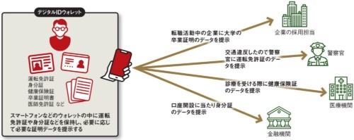
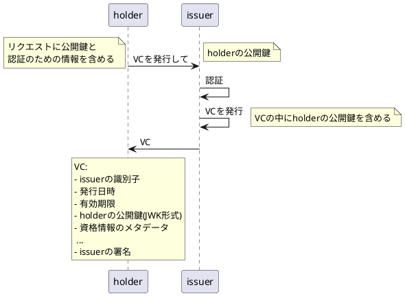
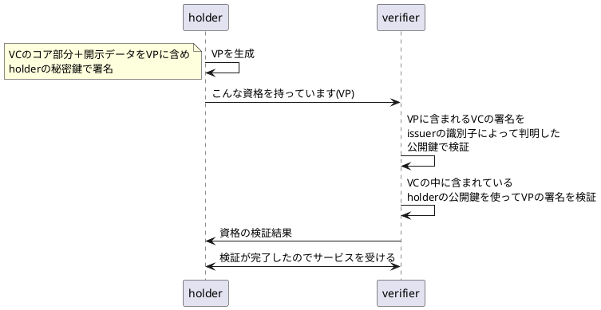
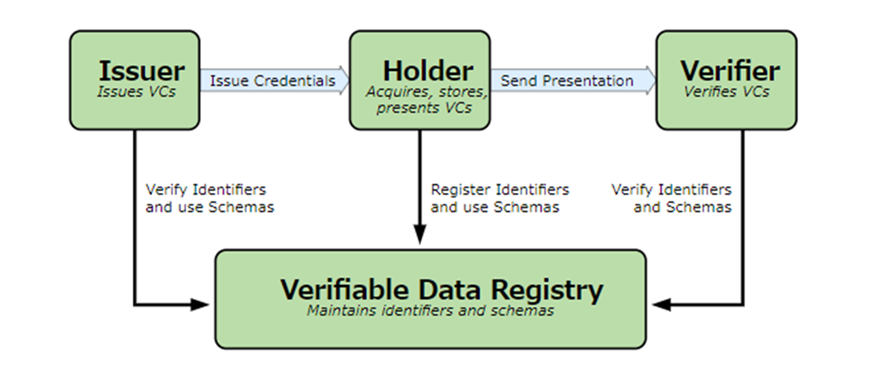

# 近い将来のアカウントやデータの在り方

## インターネット上のあるサービスを利用したい場合

1. 少し前の状態

- 各サービス提供会社のサーバにアカウントを作成してログインし、サービスを受ける。
- 各サービス会社に個人情報を登録する必要がある。
- すべてのデータがサービス会社のサーバに保存される。

2. 現在の状態

- GoogleやAmazonなどのID Providerの認証を経たアカウントで各サービス提供会社のサービスを受ける。
- 各サービス会社はサービスを受けるために必要な情報のみをID Providerから提供を受ける。
- サービスによって生じたデータ（オペレーションログなど）は、アカウントと紐づけられた状態でサービス会社のサーバに保存される。
- SNSなどのメッセージデータ、著作権データなどはサービス提供会社のサーバに保存される。
- アカウントに紐づけられる嗜好情報はサービス提供会社のサーバに保存される。
- ID Providerには個人情報を登録する必要がある。

3. 将来の状態

- 世界共通のID体系のIDを使い、すべてのサービスはこのIDでログイン、サービスを受ける。
- 各個人は個人情報や資格情報などを検証可能なデータ形式（本当にその個人が所有する資格なのか確認できる）でスマホなどに保持する。
- 各サービス会社はサービスを受けるために必要な情報のみをアカウントを持つ個人から提供を受ける。
- サービスによって生じたデータ（オペレーションログなど）は、IDと紐づけられた状態でサービス会社のサーバに保存される。
- SNSなどのメッセージデータ、著作権データなどは、検証可能なデータ形式（誰が作成したデータなのかがわかる）でサービス提供会社に保存される。
- 個人情報は国以外のサービスプロバイダーには登録する必要がない。個人のスマホなどに保存される。現実の財布にお金だけではなく会員証や免許証が入っているイメージ。

欧州では2024年から始動予定。2030年までに80%の人が利用できるようにするとしている。

## 何がうれしいのか？

- サービス提供者のサーバに個人情報を保存する必要がない。（悪いところは提示されたときに保存するかもしれないけど）
- サーバがハッキングされても個人情報が漏れにくい。
- どの情報を公開、提示するかはユーザが選ぶことができる。
- 例えば病院の診察時の情報や検査結果、処方箋の情報などは、病院が発行し、ユーザのウォレットアプリに保存することで、ほかの病院に行ったときに今までの診察された情報などを提示できる。
- 提示された病院は、本当に前の病院が発行したデータなのかを確認することができる。
- SNSなどのメッセージ一つ一つにユーザの署名が入ることで、誰がいつ発言したのかを確定できる。
- 記事を読む前に誰の発言なのかをチェックすることで、フェイク情報に踊らされる可能性が減る。

## どうやって実現する？

1. 検証可能なデータフォーマットを定義

- 検証可能なデータは、Verifiable Credentials（以下VC）という形で保存される。
- VCはJSON Web Token(以下JWT（ジョットと発音））形式で保存され、署名も付けられるのでJSON Web Signature（以下JWS）も利用する。
- VCを発行するIssuerの秘密鍵を使って署名することで、VCの中にIssuerの識別子が入っており、その識別子に対応するIssuerの公開鍵さえ簡単に手に入れば、信頼できる機関が発行したものであることが検証できる。
- VCはSD-JWT形式をとり、資格情報のデータの本文は署名時には使わず、データの本文のハッシュ値の部分を署名に使うことで、VCに含まれる複数の情報の中からverifierに渡す情報を選択して開示することができる。

### VC発行時の流れ

- 認証はVC発行リクエストの中に含まれるRAR仕様（RFC 9396）のデータによって行われる。パラメータ名はauthorization_details。
- 基本的にはholderが持つVCから生成したVPを受け渡すことで別のVC発行の許可を得る。
- トラストアンカーとしてマイナンバーカードの利用が期待されているが、現時点ではマイナンバーカードの仕組みではVCを発行してもらえない。Web2的なAPIしか提供されていない。
- ディジタル庁もこの辺りは認識しているが、そもそもマイナンバーカードが普及していないので、そちらから手を付けている段階のようだ。

### VerifierがHolderの資格を検証する時の流れ

- VCの中にholderの公開鍵が含まれていることで、VCの発行を受けた人がholderであることも同時に確認できるうえに公開鍵を探しに行く必要がない。

2. VCの受け渡し方

OpenID for Verifiable Credential Issuanceを使ってVC・VPの受け渡しを行う。
https://www.authlete.com/ja/developers/oid4vci/

OpenID Connectの派生バージョンと思えばOK。

3. 公開鍵をどうやって入手するか

VC周りを調べると必ず出てくる画像。

- VCやVPの署名は、署名に使った秘密鍵と対になる公開鍵を使って署名を検証する。
- この公開鍵をどうやって入手するかは規定されていない。
- EUのEUデジタルIDウォレット（EUDIW）では、HyperLedger（オープンソースのブロックチェーン技術）を使っているらしい。
- サーバがハッキングされることで、本当に相手が信用できるかを確認する公開鍵が改ざんされていないことを確実のものにする為に、ブロックチェーンの中に公開鍵（もしくはIPFSに公開鍵を入れ、そのハッシュ情報）を保存する。
- Verifyしたい場合はブロックチェーンから公開鍵を取り出せばいい。
